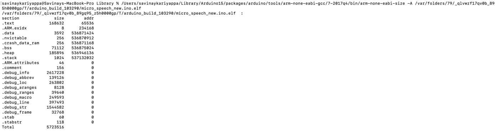

# Tiny ML benchmark

## 1. Inference time

Inference time is shown to the serial monitor. This time is captured every time a new command is spoken. 

For the sample use case the tame taken for each inference is ~72 ms.

## 2. Static Size and code size

To capture the code size and static 
1. First Enable verbose ouput in the Preferences Pane. 

2. Then after compliling the sketch we can see the command to be executed to check the code size and static data size.

3. Running this command will give the code size and static size.

4. Dynamic memory consumption is also captured during sketch compilation.

